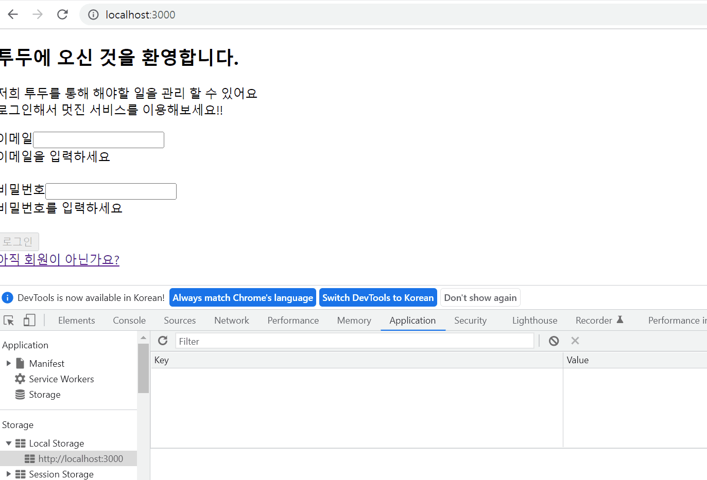
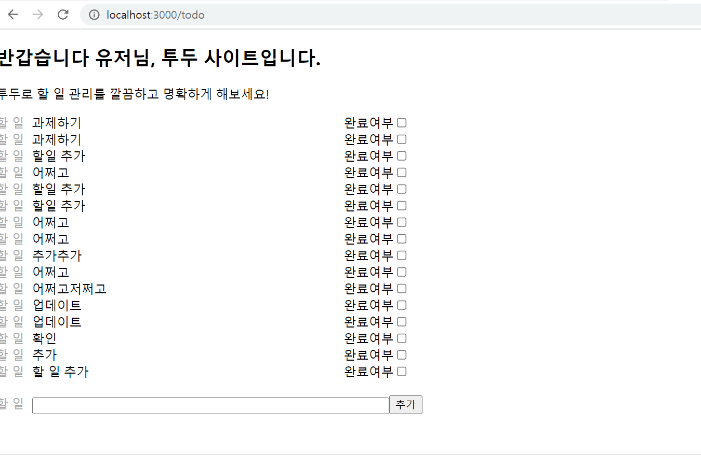

 
## :: 1. 로그인 / 회원가입

### 간단한 셋팅
* 프로젝트 실행 방법
    1. Router 설정 (로그인 : / , 회원가입 : /signup)
    2. 회원가입 / 로그인 컴포넌트 생성
    3. 회원가입과 로그인 때 쓰이는 동일한 form 컴포넌트로 분리 

### Assignment1
* 프로젝트의 실행 방법
    1. 이메일 / 비밀번호 정보 받아오기 (e.target.value)
    2. 받아온 정보를 통해 error를 보여주기
        * 아무 값도 입력하지 않았을 때
        * 정규식에 맞지 않을 때
    3. error가 없을 경우 submit 버튼을 활성화 시켜주기
* 데모영상
 

### Assignment2
* 프로젝트의 실행 방법
    1. 이메일 / 비밀번호 정보 부모 컴포넌트에서 데이터 받기
    2. 받아온 정보 회원가입 할 때 axios에 Post로 보내기
        * 응답을 확인하면 회원가입 완료 alert 창 띄우기
        * 실패 시, response 내에 있는 message를 띄워 사용자에게 문제가 뭔지 인식
    3. 회원가입 성공하면 로그인 창으로 navigate 해주기
    4. 로그인을 성공하면 로컬 스토리지에 토큰을 저장하기
        * 실패 시, 회원가입과 동일
    5. 로컬 스토리지에 토큰이 있는 지 확인 후 있으면 todo 사이트로 navigate 해주기
* 데모영상 
 

### Assignment3
* 프로젝트의 실행 방법
    1. 로컬스토리지에 getItem으로 토큰이 있는 지 확인한다.
    2. 있으면 /todo 로 navigate 시켜주고
    3. 없으면 / 로 navigate 시켜준다.
* 데모영상 
 

 

## :: 2. 투두 리스트
### Assignment4
* 프로젝트의 실행 방법
    1. form 태그 안에 input 창과 submit 버튼을 만들어 줍니다.
    2. submit 눌렀을 때 input 창의 value를 받게 합니다.
    3. 이 value를 /todos의 post의 body에 넣습니다.
    4. 사용자 인증을 위하여 localstorage에 getItem을 받아 Bearer 과 함께 문자열을 만들어 줍니다.
    5. 이렇게 만들아진 /todos를 useEffect를 통해 첫 랜더링 때 get으로 받습니다.
    6. useState로 5번의 데이터를 담아 map을 이용하여 html 요소로 뿌려줍니다.
        * 이 때 key는 id로 합니다.
    7. post로 받은 데이터를 setTodo로 업데이트 시켜줍니다.
        * 불변성을 해치지 않기 위해 기존 데이터를 스프레드 문법을 이용합니다.
* 데모영상 
 

### Assignment5
* 프로젝트의 실행 방법
* 데모영상
