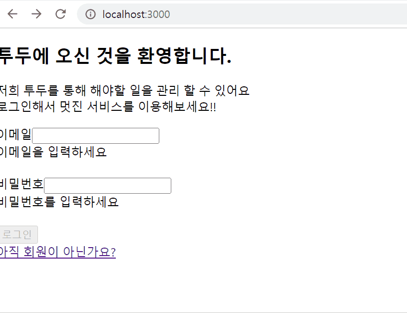
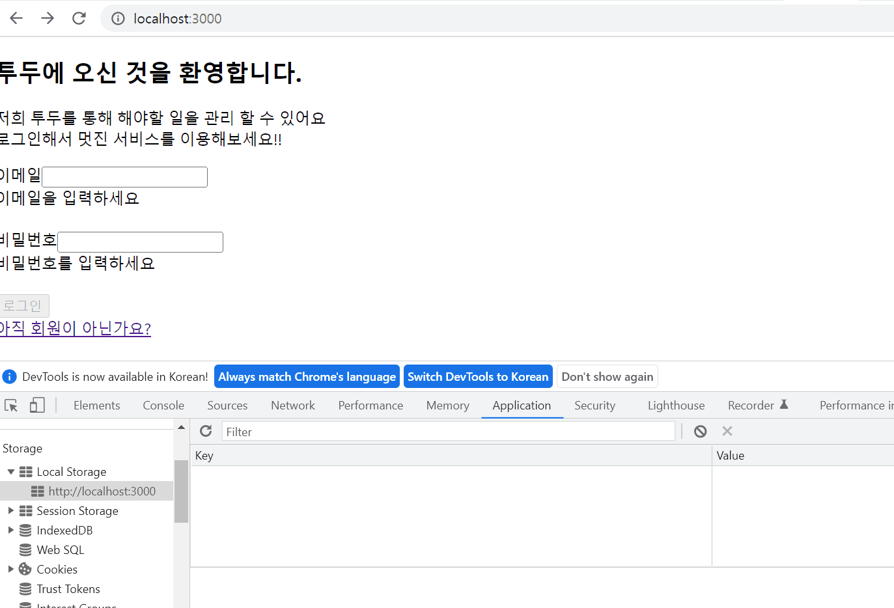

 
## :: 1. 로그인 / 회원가입

### 간단한 셋팅
* 프로젝트 실행 방법
    1. Router 설정 (로그인 : / , 회원가입 : /signup)
    2. 회원가입 / 로그인 컴포넌트 생성
    3. 회원가입과 로그인 때 쓰이는 동일한 form 컴포넌트로 분리 

### Assignment1
* 프로젝트의 실행 방법
    1. 이메일 / 비밀번호 정보 받아오기 (e.target.value)
    2. 받아온 정보를 통해 error를 보여주기
        * 아무 값도 입력하지 않았을 때
        * 정규식에 맞지 않을 때
    3. error가 없을 경우 submit 버튼을 활성화 시켜주기
* 데모영상
 

### Assignment2
* 프로젝트의 실행 방법
    1. 이메일 / 비밀번호 정보 부모 컴포넌트에서 데이터 받기
    2. 받아온 정보 회원가입 할 때 axios에 Post로 보내기
        * 응답을 확인하면 회원가입 완료 alert 창 띄우기
        * 실패 시, response 내에 있는 message를 띄워 사용자에게 문제가 뭔지 인식
    3. 회원가입 성공하면 로그인 창으로 navigate 해주기
    4. 로그인을 성공하면 로컬 스토리지에 토큰을 저장하기
        * 실패 시, 회원가입과 동일
    5. 로컬 스토리지에 토큰이 있는 지 확인 후 있으면 todo 사이트로 navigate 해주기
* 데모영상 
 

### Assignment3
* 프로젝트의 실행 방법
* 데모영상 

 

## :: 2. 투두 리스트
### Assignment4
* 프로젝트의 실행 방법
* 데모영상 

### Assignment5
* 프로젝트의 실행 방법
* 데모영상
